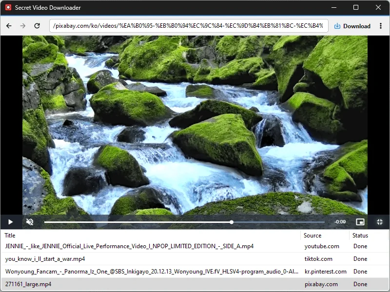

# SecretVideo

**Un reproductor dedicado para ver vídeos de muchos sitios — y guardarlos cuando lo necesites.**

[English](README.md) · [한국어](README.ko.md) · [简体中文](README.zh-CN.md) · [日本語](README.ja.md) · Español · [Português (Brasil)](README.pt-BR.md) · [Français](README.fr.md)

> Este documento es una traducción. En caso de discrepancia, prevalece la [versión en coreano](README.ko.md).

## Descripción

SecretVideo es un reproductor tipo navegador creado para sitios de vídeo. Elige un sitio en la pantalla de inicio y se abre al instante; cuando pones un vídeo a pantalla completa, se convierte en una pequeña **ventana PIP** para que sigas viéndolo mientras haces otra cosa.

Cuando el vídeo que estás viendo se puede guardar, aparece un **botón de descarga** junto a la barra de direcciones. Con un clic se guarda en el formato y la calidad que hayas elegido: original, MP4 o MP3. Los sitios que requieren inicio de sesión también funcionan: inicia sesión una vez dentro de SecretVideo y la sesión se mantiene.

El bloqueo de anuncios viene activado, `Ctrl+P` guarda la página completa que estás viendo como imagen y `Ctrl+R` graba lo que estás viendo, con sonido, como vídeo.

## Características

- **Pantalla de inicio con sitios** — YouTube, Twitch, TikTok, CHZZK, Netflix, TVING, Wavve, Watcha, Coupang Play y más en un solo lugar. Añade o edita la lista como quieras.
- **Pantalla completa → PIP automático** — al poner un vídeo a pantalla completa se convierte en una pequeña ventana siempre visible. Arrástrala donde quieras y cambia su tamaño desde los bordes.
- **Botón de descarga que solo aparece cuando puede funcionar** — se desliza cuando hay un vídeo listo para guardar. No aparece con anuncios ni con emisiones en directo.
- **Formato y calidad a tu elección** — Original / MP4 / MP3, 720p / 1080p / Mejor calidad.
- **Ventana de lista de descargas** — miniaturas y progreso de un vistazo, con una notificación de Windows al terminar.
- **Amplia compatibilidad de sitios** — incorpora un motor de descarga muy extendido (yt-dlp); en los sitios que no conoce, SecretVideo localiza por sí mismo el archivo en reproducción y lo guarda.
- **Sesión iniciada** — inicia sesión en un sitio dentro de SecretVideo y podrás ver y guardar también los vídeos solo para miembros.
- **Bloqueo de anuncios** — uBlock Origin Lite está integrado y se activa o desactiva desde el menú. Se actualiza solo a la última versión.
- **Captura de página completa** — `Ctrl+P` guarda toda la página, incluido lo que queda por debajo, como PNG.
- **Grabación de pantalla** — el botón Grabar o `Ctrl+R` graba lo que estás viendo como MP4. Solo se graba el sonido del propio SecretVideo.
- **Ventana de configuración** — opciones de guardado, calidad, PIP, aceleración por hardware, extensiones y atajos en una sola ventana. Los atajos se pueden cambiar por la tecla que quieras.
- **Recuerda tus ventanas** — posición/tamaño/estado maximizado de la ventana principal, posición y tamaño de la ventana PIP, posición de la lista de descargas.

## Descarga / Instalación

| Paquete | Enlace |
|---|---|
| Instalador | [Descargar](https://down.kilho.net/secretvideo?lang=es) |
| Portable (ZIP) | [Descargar](https://down.kilho.net/secretvideo?lang=es&nosetup) |

SecretVideo puede usarse como aplicación portable: descomprime el ZIP donde quieras y ejecuta `SecretVideo.exe`.

**En el primer inicio** descarga los componentes necesarios para guardar vídeos (motor de descarga, conversor, bloqueador de anuncios). Espera a que termine la ventana de progreso. Esto ocurre una sola vez; después solo vuelve a descargar cuando un componente ha cambiado.

## Uso

### Primeros pasos

1. Inicia SecretVideo. Aparece la **pantalla de inicio con sitios**. Haz clic en el que quieras.
2. Navega por el sitio y reproduce un vídeo como en cualquier navegador.
3. Si el vídeo se puede guardar, aparece un **botón de descarga** (↓) a la derecha de la barra de direcciones. Haz clic y la descarga empieza de inmediato.
4. La ventana **Lista de descargas** se abre automáticamente y muestra el progreso. Al terminar aparece una notificación de Windows; haz clic en ella para abrir la carpeta de destino.

La carpeta de destino predeterminada es la carpeta **Descargas** de tu PC. Cámbiala en el menú (⋮) → **Configuración de carpeta**, o ábrela con **Abrir carpeta**.

### La ventana

| Control | Función |
|---|---|
| ◀ ▶ | Atrás / Adelante |
| ⟳ / ✕ | Recargar (Detener mientras carga una página) |
| Barra de direcciones | Escribe una dirección para ir a ella, o palabras para buscar |
| ● / ■ | Grabar / Detener grabación |
| ↓ | Botón de descarga — solo aparece cuando hay un vídeo listo para guardar |
| ⋮ | Menú |

El título de la ventana sigue al título de la página. Si un sitio intenta abrir una ventana nueva, SecretVideo la abre en la ventana actual.

### Cómo…

**Guardar un vídeo de YouTube como MP3**
Menú → **Configuración de formato → MP3** y luego pulsa el botón de descarga en la página del vídeo. Solo se descarga el audio y se convierte a MP3. El ajuste de calidad no afecta al MP3.

**Obtener un archivo que se reproduzca en un televisor u otros dispositivos**
Elige **Configuración de formato → MP4**. A igual resolución, SecretVideo prefiere el formato H.264, ampliamente compatible, así que es menos probable que el archivo no se abra en un reproductor básico o en un televisor. **Original** guarda lo que ofrece el sitio tal cual (unido en MP4 cuando hace falta).

**Ahorrar espacio, o conseguir la mejor calidad**
En **Calidad de descarga** elige **720p**, **1080p** (predeterminado) o **Mejor calidad**. 720p y 1080p significan «hasta esa resolución»: si no está disponible, se usa la inmediatamente inferior.

**Las descargas fallan o se quedan colgadas**
Prueba **Velocidad de descarga → Estable**. Descarga las partes de una en una, lo que aguanta bien una conexión poco fiable. Si tu conexión es rápida, **Rápida** (varias partes a la vez) es mucho más veloz. El valor predeterminado es **Normal**.

**Vídeos solo para miembros que requieren inicio de sesión**
Inicia sesión en el sitio dentro de SecretVideo como lo harías normalmente. La sesión se conserva, así que a partir de entonces los vídeos de miembros se reproducen directamente y el botón de descarga aparece siempre que un vídeo se puede guardar.

**Descargar una lista de reproducción completa**
En una página de lista de reproducción de YouTube, pulsa el botón de descarga para descargar toda la lista una tras otra. Las listas **Mix / Radio** generadas automáticamente son la excepción: solo se descarga el vídeo que estás viendo.

**Sitios donde se pasa de vídeo en vídeo desplazándose (TikTok y similares)**
SecretVideo detecta qué vídeo se está reproduciendo aunque la dirección de la página no cambie, así que desplázate hasta el que te guste y pulsa el botón de descarga.

**Sitios de streaming como CHZZK y Twitch**
Las repeticiones (VOD) y los clips se pueden guardar. **Las emisiones en directo no se pueden guardar**, y el botón de descarga no aparece con ellas.

**Enlaces antiguos de Naver TV y clips de Naver**
Los vídeos de Naver TV se han trasladado a los clips de Naver, pero si abres una dirección antigua de Naver TV o un enlace copiado de la búsqueda de Naver, puedes guardar el vídeo directamente desde el visor de clips. Al desplazarte al siguiente vídeo, se guarda el que estás viendo en ese momento.

**Seguir viendo mientras trabajas (PIP)**
Pon un vídeo a **pantalla completa** y SecretVideo se convierte automáticamente en una pequeña ventana PIP siempre visible.
- **Arrastra** la ventana para moverla.
- Agarra un **borde** para cambiar el tamaño.
- Menú del **botón derecho**: Volver a la ventana normal / Siempre visible sí o no / Salir.
- Cuando el sitio sale de pantalla completa, la ventana vuelve a su tamaño y posición anteriores.
- La posición y el tamaño de la ventana PIP se recuerdan para la próxima vez.
- Si no quieres esto, desactiva Menú → **Activar PIP al entrar en pantalla completa**. La pantalla completa usará entonces todo el monitor, como un navegador normal.

**Conservar una página entera como imagen**
Pulsa `Ctrl+P`. **La página completa** — no solo la parte visible, sino todo lo que queda por debajo — se guarda en la carpeta de destino como `SecretVideo-001.png` y aparece una notificación. Útil para conservar publicaciones, comentarios o pantallas con subtítulos.

**Conservar lo que estás viendo como vídeo**
Pulsa el botón **Grabar** (●) a la derecha de la barra de direcciones, o `Ctrl+R`. La grabación empieza y el botón cambia a ■. Púlsalo de nuevo para terminar; el vídeo se guarda en la carpeta de destino con un nombre como `SecretVideo-001.mp4` y aparece una notificación.
- Solo se graba el **sonido que sale de SecretVideo**. La música de otros programas y los sonidos de notificación de Windows quedan fuera.
- Si mueves la ventana mientras grabas, la grabación la sigue. El tamaño de la grabación es el de la ventana al empezar, así que ajústalo antes.
- Si cierras el programa durante la grabación, el vídeo grabado hasta ese momento se finaliza y se guarda.

**Los anuncios molestan / un sitio falla por el bloqueo de anuncios**
El bloqueo de anuncios (uBlock Origin Lite) viene activado. Si un sitio concreto no funciona bien, desactívalo un momento en Menú → **Extensiones** (o **Configuración → Extensiones**). Cuando sale una nueva versión del bloqueador, se sustituye automáticamente la próxima vez que inicias el programa.

**Gestionar los archivos descargados (ventana Lista de descargas)**
Ábrela en cualquier momento desde Menú → **Lista de descargas**. Cada fila muestra miniatura, título, origen y estado (Inactivo → Análisis → Recepción → Conversión → Hecho), y el fondo de la fila muestra el progreso.
- **Doble clic**: abrir el archivo descargado
- **Tecla Supr**: quitar de la lista
- **Botón derecho**: Ir al origen / Abrir carpeta / Ver registro / Eliminar
- Cerrar la ventana o pulsar `ESC` solo la oculta; las descargas continúan.
- Al pulsar el botón de descarga en un vídeo ya descargado o en descarga, se abre esta ventana y muestra su estado.

**Descargar el mismo vídeo dos veces**
Si ya existe un archivo con el mismo nombre, no se sobrescribe; se añade un número como `(1)`, `(2)`.

**Editar la pantalla de inicio**
Usa **Edit** en la pantalla de inicio para añadir o quitar sitios, y **Reset** para restaurar la lista predeterminada. Dejar solo los sitios que realmente usas hace que empezar sea más rápido.

**Cambiar los atajos**
En Menú → **Configuración → Atajos**, cambia **Captura de pantalla** (predeterminado `Ctrl+P`) e **Iniciar/detener grabación** (predeterminado `Ctrl+R`). Haz clic en un campo y aparecerá «Pulse una tecla…»; pulsa la tecla que quieras y se asigna al momento.
- `Retroceso`: restaurar la tecla predeterminada solo de esa acción
- `Esc` o volver a hacer clic en el mismo campo: salir sin cambiar
- Una tecla que ya usa otra acción no se acepta; aparece el aviso **Ya se usa en «…».**

**Dibujar la pantalla sin la tarjeta gráfica**
Pon Menú → **Configuración → General → Aceleración por hardware** en **Desactivado**, y la pantalla se dibuja y los vídeos se reproducen con la CPU en lugar de la tarjeta gráfica. El cambio se aplicará al reiniciar el programa.

### Aviso sobre derechos de autor

SecretVideo es una herramienta para ver y conservar (guardar y grabar), con fines personales, vídeos que tienes derecho a usar. Respeta las condiciones de servicio y los derechos de autor de cada sitio.

## Configuración

Todo se cambia en una sola ventana desde Menú (⋮) → **Configuración** (General, Extensiones, Atajos). Los elementos más usados también se pueden cambiar directamente desde el menú. Los cambios se aplican al instante y se guardan automáticamente.

| Elemento | Qué ajusta | Predeterminado |
|---|---|---|
| Configuración de carpeta / Abrir carpeta | Dónde se guardan los archivos | Carpeta Descargas |
| Configuración de formato | Original / MP4 / MP3 | Original |
| Velocidad de descarga | Estable / Normal / Rápida | Normal |
| Calidad de descarga | 720p / 1080p / Mejor calidad | 1080p |
| Lista de descargas | Mostrar u ocultar la ventana de la lista | Se abre sola al empezar una descarga |
| Activar PIP al entrar en pantalla completa | Convertir la pantalla completa en ventana PIP | Activado |
| Extensiones | Bloqueo de anuncios sí o no | Activado |
| Aceleración por hardware | Activado / Desactivado (se aplica al reiniciar) | Activado |
| Atajo — Captura de pantalla | Guardar la página completa como imagen | `Ctrl+P` |
| Atajo — Iniciar/detener grabación | Grabación de pantalla | `Ctrl+R` |

El idioma de la interfaz sigue al idioma de visualización de Windows (coreano → coreano, cualquier otro → inglés).

## Requisitos

- Windows 10 o Windows 11, **64 bits**
- Microsoft Edge WebView2 Runtime (ya presente en Windows 11 y en Windows 10 reciente; el instalador lo añade si falta)
- Conexión a Internet (descarga de componentes en el primer inicio, ver y guardar vídeos)
- Windows 10 versión 2004 o posterior para grabar también el sonido

## Actualizaciones

SecretVideo **no** se actualiza solo. Las nuevas versiones se publican manualmente tras una verificación interna y se anuncian en la [página de SecretVideo](https://kilho.net/secretvideo). Consulta el [aviso sobre la política de actualizaciones](https://en.kilho.net/archives/notice/2940).

La única excepción es el bloqueador de anuncios integrado (uBlock Origin Lite): cuando sale una nueva versión, se sustituye automáticamente por la última la próxima vez que inicias el programa.

## Licencia

SecretVideo es **Freeware**.

Puedes usarlo en cualquier lugar —en casa, en la oficina, en centros educativos y en organismos públicos— y redistribuirlo libremente en su forma sin modificar.

## Enlaces

- Sitio web: <https://kilho.net/secretvideo>
- Foro: <https://kilho.top/forum/qna>
- X (Twitter): <https://www.twitter.com/kilhonet>

© KILHO.NET
