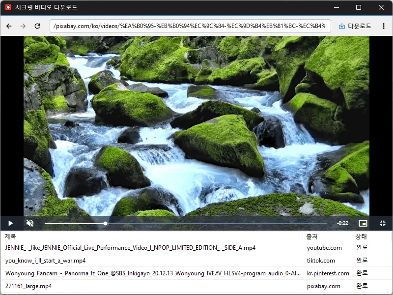

# 시크릿비디오

**여러 사이트의 동영상을 편하게 보고, 필요하면 저장하는 전용 플레이어.**

[English](README.md) · 한국어 · [简体中文](README.zh-CN.md) · [日本語](README.ja.md) · [Español](README.es.md) · [Português (Brasil)](README.pt-BR.md) · [Français](README.fr.md)

## 소개

시크릿비디오는 동영상 사이트를 보기 위해 만든 전용 브라우저형 플레이어입니다. 첫 화면에서 자주 가는 사이트를 고르면 바로 열리고, 영상을 전체화면으로 켜면 작은 **PIP 창**으로 바뀌어 다른 일을 하면서도 계속 볼 수 있습니다.

보고 있는 영상을 저장할 수 있으면 주소창 옆에 **다운로드 버튼**이 나타납니다. 버튼 하나로 원본·MP4·MP3 중 원하는 형식과 화질로 받을 수 있고, 로그인이 필요한 사이트도 시크릿비디오 안에서 로그인해 두면 그대로 이용할 수 있습니다.

광고 차단이 기본으로 켜져 있고, `Ctrl+P` 한 번으로 보고 있는 페이지 전체를 이미지로 저장할 수 있습니다.

## 주요 기능

- **사이트 첫 화면** — YouTube, Twitch, TikTok, 치지직, 넷플릭스, 티빙, 웨이브, 왓챠, 쿠팡플레이 등 자주 가는 사이트를 한곳에. 목록은 원하는 대로 추가·편집할 수 있습니다.
- **전체화면 → PIP 자동 전환** — 영상을 전체화면으로 켜면 항상 위에 떠 있는 작은 창으로 바뀝니다. 끌어서 옮기고, 가장자리를 잡아 크기를 바꿀 수 있습니다.
- **받을 수 있을 때만 나타나는 다운로드 버튼** — 받을 수 있는 영상이 준비되면 버튼이 슬라이드로 나타납니다. 광고나 생방송에는 나타나지 않습니다.
- **저장 형식·화질 선택** — 원본 / MP4 / MP3, 720p / 1080p / 최고 화질.
- **다운로드 목록 창** — 썸네일과 진행률을 한눈에. 완료되면 Windows 알림이 뜹니다.
- **다양한 사이트 지원** — 널리 쓰이는 다운로드 엔진(yt-dlp)을 내장했고, 엔진이 모르는 사이트는 재생 중인 파일을 직접 찾아 저장합니다.
- **로그인한 상태 그대로** — 시크릿비디오 안에서 로그인해 두면 회원 전용 영상도 보고 저장할 수 있습니다.
- **광고 차단** — uBlock Origin Lite가 내장되어 있으며 메뉴에서 켜고 끌 수 있습니다.
- **전체 페이지 캡처** — `Ctrl+P`로 스크롤 아래까지 페이지 전체를 PNG로 저장합니다.
- **창 상태 기억** — 창 위치·크기·최대화, PIP 창 위치·크기, 다운로드 목록 창 위치를 기억합니다.

## 다운로드 / 설치

| 종류 | 링크 |
|---|---|
| 설치판 | [다운로드](https://down.kilho.net/secretvideo?lang=ko) |
| 포터블 (ZIP) | [다운로드](https://down.kilho.net/secretvideo?lang=ko&nosetup) |

포터블로도 사용할 수 있습니다. ZIP을 원하는 위치에 풀고 `SecretVideo.exe`를 실행하면 됩니다.

**처음 실행할 때** 동영상 저장에 필요한 구성 요소(다운로드 엔진, 변환 도구, 광고 차단기)를 자동으로 내려받습니다. 진행창이 끝날 때까지 잠시 기다려 주세요. 이 과정은 한 번만 하며, 이후에는 구성 요소가 바뀐 경우에만 다시 받습니다.

## 사용법

### 처음 사용하기

1. 시크릿비디오를 실행하면 **사이트 첫 화면**이 나옵니다. 보고 싶은 사이트를 클릭합니다.
2. 사이트가 열리면 평소 브라우저처럼 둘러보고 영상을 재생합니다.
3. 영상을 저장할 수 있으면 주소창 오른쪽에 **다운로드 버튼**(↓)이 나타납니다. 누르면 바로 저장이 시작됩니다.
4. 저장이 시작되면 **다운로드 목록** 창이 자동으로 열려 진행률을 보여 줍니다. 끝나면 Windows 알림이 뜨고, 알림을 누르면 저장 폴더가 열립니다.

저장 폴더는 기본적으로 **내 PC의 다운로드 폴더**입니다. 메뉴(⋮) → **저장폴더 설정**에서 바꿀 수 있고, **저장폴더 열기**로 바로 열 수 있습니다.

### 화면 구성

| 위치 | 역할 |
|---|---|
| ◀ ▶ | 뒤로 / 앞으로 |
| ⟳ / ✕ | 새로고침 (불러오는 중에는 중지) |
| 주소창 | 주소를 입력하면 그 페이지로, 주소가 아닌 낱말을 입력하면 검색 결과로 이동 |
| ↓ | 다운로드 버튼 — 받을 수 있는 영상이 준비됐을 때만 나타남 |
| ⋮ | 메뉴 |

창 제목은 보고 있는 페이지 제목으로 바뀝니다. 사이트가 새 창을 열려고 해도 시크릿비디오는 현재 창 안에서 엽니다.

### 이럴 때 이렇게

**유튜브 영상을 MP3로 뽑고 싶을 때**
메뉴 → **저장포맷 설정 → MP3**를 고른 뒤 영상 페이지에서 다운로드 버튼을 누릅니다. 음성만 받아 MP3로 변환해 저장합니다. 화질 설정은 MP3에는 영향이 없습니다.

**TV나 다른 기기에서도 재생되는 파일로 받고 싶을 때**
**저장포맷 설정 → MP4**를 고릅니다. 시크릿비디오는 같은 화질이면 호환성이 좋은 H.264 형식을 먼저 고르므로, 기본 플레이어나 TV에서 열리지 않는 문제가 줄어듭니다. **원본**은 사이트가 주는 파일을 그대로(필요하면 MP4로 합쳐서) 저장합니다.

**용량을 아끼고 싶을 때 / 최고 화질로 받고 싶을 때**
**다운로드 화질**에서 **720p**, **1080p**(기본), **최고 화질** 중 고릅니다. 720p·1080p는 "최대 그 해상도"라는 뜻이라, 그 해상도가 없으면 바로 아래 해상도를 받습니다.

**다운로드가 자주 끊기거나 실패할 때**
**다운로드 속도 → 안정 모드**로 바꿔 보세요. 영상을 한 조각씩 차례로 받아 불안정한 네트워크에서도 잘 버팁니다. 반대로 회선이 빠르면 **고속 모드**(여러 조각을 동시에 받음)가 훨씬 빠릅니다. 기본은 **표준 모드**입니다.

**회원 전용·로그인이 필요한 영상**
시크릿비디오 안에서 그 사이트에 평소처럼 로그인하세요. 로그인 상태가 유지되므로 이후에는 회원 영상도 바로 보고, 받을 수 있는 영상이면 다운로드 버튼이 나타납니다.

**재생목록 전체를 받고 싶을 때**
유튜브 재생목록 페이지에서 다운로드 버튼을 누르면 목록 전체를 차례로 받습니다. 단, 자동 생성되는 **믹스/라디오** 목록은 지금 보는 영상 하나만 받습니다.

**틱톡처럼 스크롤로 영상을 넘기는 사이트**
페이지 주소가 바뀌지 않아도 지금 재생 중인 영상을 알아채므로, 스크롤하다가 마음에 드는 영상에서 바로 다운로드 버튼을 누르면 됩니다.

**치지직·트위치 같은 방송 사이트**
다시보기와 클립은 받을 수 있습니다. **생방송은 저장할 수 없으며** 다운로드 버튼도 나타나지 않습니다.

**영상을 보면서 다른 일을 하고 싶을 때 (PIP)**
영상을 **전체화면**으로 켜면 시크릿비디오가 자동으로 작은 PIP 창(항상 위)으로 바뀝니다.
- 창을 **끌어서** 원하는 자리로 옮깁니다.
- **가장자리**를 잡아 크기를 바꿉니다.
- **우클릭** 메뉴: 원래화면으로 돌아가기 / 항상 화면 위에 표시 켜고 끄기 / 종료하기.
- 사이트에서 전체화면을 해제하면 원래 창 크기와 위치로 돌아옵니다.
- PIP 창의 위치와 크기는 기억되어 다음에도 같은 자리에 뜹니다.
- 이 동작이 필요 없으면 메뉴 → **전체화면 전환시 PIP 활성화**를 끄면 됩니다. 그러면 보통 브라우저처럼 모니터 전체를 씁니다.

**보고 있는 페이지를 통째로 이미지로 남기고 싶을 때**
`Ctrl+P`를 누르면 화면에 보이는 부분뿐 아니라 **페이지 전체**(스크롤 아래까지)가 `SecretVideo-001.png` 같은 이름으로 저장 폴더에 저장되고 알림이 뜹니다. 게시글·댓글·자막 화면을 보관할 때 편리합니다.

**광고가 거슬릴 때 / 광고 차단 때문에 사이트가 이상할 때**
광고 차단(uBlock Origin Lite)은 기본으로 켜져 있습니다. 특정 사이트가 제대로 동작하지 않으면 메뉴 → **확장프로그램**에서 잠시 끌 수 있습니다.

**받은 파일 관리 (다운로드 목록 창)**
메뉴 → **다운로드 목록**으로 언제든 열 수 있습니다. 각 줄에 썸네일·제목·출처·상태(대기 → 분석 → 수신 → 변환 → 완료)가 보이고, 줄 배경이 진행률을 나타냅니다.
- **더블클릭**: 받은 파일 열기
- **Delete 키**: 목록에서 삭제
- **우클릭**: 원본 페이지로 가기 / 저장 폴더 열기 / 로그 보기 / 삭제
- 창을 닫거나 `ESC`를 눌러도 다운로드는 계속되고, 창만 숨겨집니다.

**같은 영상을 두 번 받으면**
같은 이름의 파일이 있으면 덮어쓰지 않고 `(1)`, `(2)`처럼 번호를 붙여 저장합니다.

**사이트 첫 화면 편집**
첫 화면의 **Edit**로 사이트를 추가·삭제하고, **Reset**으로 기본 목록으로 되돌립니다. 자주 가는 사이트만 남겨 두면 시작이 빨라집니다.

### 저작권 안내

시크릿비디오는 이용 권한이 있는 영상을 개인적으로 보고 보관하는 데 쓰는 도구입니다. 각 사이트의 이용약관과 저작권을 지켜 주세요.

## 설정

설정 창은 따로 없고 메뉴(⋮)에서 바로 바꿉니다. 모든 설정은 자동으로 저장됩니다.

| 메뉴 | 내용 | 기본값 |
|---|---|---|
| 저장폴더 설정 / 열기 | 파일을 저장할 폴더 | 다운로드 폴더 |
| 저장포맷 설정 | 원본 / MP4 / MP3 | 원본 |
| 다운로드 속도 | 안정 / 표준 / 고속 | 표준 |
| 다운로드 화질 | 720p / 1080p / 최고 화질 | 1080p |
| 다운로드 목록 | 목록 창 열기·닫기 | 다운로드 시작 시 자동 열림 |
| 전체화면 전환시 PIP 활성화 | 전체화면을 PIP 창으로 | 켬 |
| 확장프로그램 | 광고 차단 켜고 끄기 | 켬 |

화면 언어는 Windows 표시 언어를 따릅니다(한국어 → 한국어, 그 외 → 영어).

## 요구 사항

- Windows 10 또는 Windows 11, **64비트**
- Microsoft Edge WebView2 런타임 (Windows 11과 최근 Windows 10에는 이미 들어 있으며, 설치판은 없으면 함께 설치합니다)
- 인터넷 연결 (처음 실행 시 구성 요소 내려받기, 영상 시청·저장)

## 업데이트

시크릿비디오는 스스로 업데이트하지 **않습니다**. 새 버전은 내부 검증을 거쳐 수동으로 배포되며 [시크릿비디오 페이지](https://kilho.net/secretvideo)에 공지됩니다. [업데이트 정책 안내](https://kilho.net/archives/notice/2940)를 참고하세요.

## 라이선스

시크릿비디오는 **프리웨어**입니다.

가정, 회사, 학교, 관공서 등 어디서나 자유롭게 사용할 수 있으며, 수정하지 않은 형태라면 어디든 자유롭게 재배포할 수 있습니다.

## 링크

- 웹사이트: <https://kilho.net/secretvideo>
- 포럼: <https://kilho.top/forum/qna>
- X (트위터): <https://www.twitter.com/kilhonet>

© KILHO.NET
